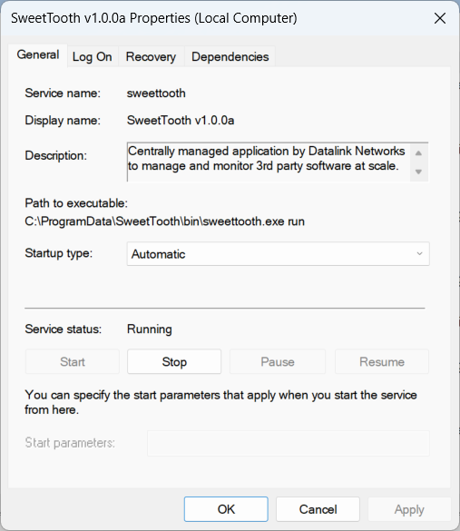

<div align="center"></div>

### A self-hosted Chocolatey wrapper providing the ability to inventory, manage, and update 3rd party software using Chocolatey over a large number of machines.

# SweetTooth Client

The sweettooth client is an agent service meant to run on modern Microsoft Windows endpoints which are supported by Chocolatey:

- Windows Server 2012, 2012 R2, 2016, 2019, 2022
- Windows 10, 11

It runs as a service and will perpetually perform the following logic loop:

1) Check the node's current registration status with the server
2) Acquire the node's maintenance schedule from the server if necessary
3) If the current iteration of the loop is inside the maintenance window, perform the Chocolatey package jobs (**install**, **upgrade**, or **uninstall**)
4) Inventory the system for software managed and unmanaged by Chocolatey. Report all changes in installed software and detected outdated software.

SweetTooth is designed to be a self-contained executable to make ease of distribution and whitelistic simple. It has built-in functionality to install itself into `C:\ProgramData\SweetTooth` and create the necessary files, to create the service, and to uninstall the service. These are the commands you can pass to SweetTooth:

```
sweettooth [requires flags] install
sweettooth uninstall
sweettooth start
sweettooth stop
sweettooth status
sweettooth run
```

## Installation

A basic installation is as follows:
```
sweettooth.exe -url https://sweettooth.example.com -token [Registration Token] install
```
| Flag | Type | Default | Description |
| ---- | ---- | ------- | ----------- |
| -url | string | *required* | The A URL for the SweetToooth server |
| -token | string | *required* | The token used to register the node with the server |
| -insecure | bool | false | Disable HTTPS certificate verification (not recommended) |
| -nopath | bool | false | Disables modifications to %PATH% |
| -override | bool | false | Install the current executable even if it exists |
| -loglevel | string | "info" | The logging level to use for sweettooth |

For the installation to be successful, it requires a successful registration process which means the server must be online and the registration token must be valid. Once verified, the binary is copied and the service is installed and started. After installation, the binary you used to install can be deleted.

## Service

The SweetTooth executable does not undergo a complex installation process, but it does create a service using the `kardianos/service` package which is visible from the Services Management Console (`win + r > services.msc`). This service can be started, stopped, or disabled at will.




## Directory

SweetTooth will create the following directories for each of its purposes:

```
C:\ProgramData\SweetTooth\
|
| bin\
|  - Contains the SweetTooth executable which is called by the service
|
| logs\
|  - Contains the logs SweetTooth writes to. Logs rotated every 25MB, retained for 1 year
|
| keys\
|  - Holds ED25519 keys in the plaintext `public.pem` and the DPAPI-encrypted `secret.pem`
|
| sweettooth.yaml
|  - Cofiguration file with basic client/server settings (created on install)
```

## Software Tracking

For the source of the software tracking feature of SweetTooth, we use the output of the following two commands:

- `choco list --include-programs`
    Includes the names and versions of software installed on the systemm managed by Chocolatey, or found in the installed programs
- `choco outdated`
    Includes any packages that are managed by chocolatey and have newer versions available. Include name and current/new versions.

Combined, these allow the tracking of any software changes on the running system. Anything installed inside or outside of Chocolatey will be reported and an administrator can view it, manually onboard software into Chocolatey, or install fresh packages.


## Authorization

Each node generates a public/private ED25519 keypair used for signing.

- The public key is submitted to and stored by the server upon registration.
- The private key is encrypted using Microsoft's DPAPI and saved to disk.
- When a node interacts with the server, it requires a signed authorization header token. The client will not be able to acquire jobs or submit software changes until it is approved.
- JWTs are time-sensitive. There is a generous amount of drift accounted for within the validation process, but if the system time is more than several minutes off, it is likely to fail to authenticate.


# SweetTooth Server

The sweettooth server consists of 3 main components:

1) The SweetTooth server executable which serves the application on HTTP(S)
2) A database that contains private but not necessarily sensitive information
3) Static web assets used for templating and rendering the web front-end

## Configuration

SweetTooth Server is a binary that interacts with a PostgreSQL database. It is configured using environment variables to pass credentials used to connect to the database. To make the configuration easier, it re-uses several of the same environment variables as the postgres official image with additional ones:

| Variable | Default | Purpose |
| -------- | ------- | ------- |
| `POSTGRES_USER` | *required* | PostgreSQL username |
| `POSTGRES_PASSWORD` | *required* | PostgreSQL password |
| `POSTGRES_HOST` | `"localhost"` | PostgreSQL host |
| `POSTGRES_PORT` | `5432` | PostgreSQL port |
| `POSTGRES_DB` | `"sweettooth"` | PostgreSQL database name |
| `SWEEETTOOTH_SECRET` | *required, any string* | Secret used to sign web tokens |

## API

The API is broken into two components:
- **Node API**: handles connections from the sweettooth Windows client running on nodes
  - JWT Authorization token is signed by each node with a public key registered in the database
  - Simple JSON API:
    - Success: Returns the JSON object directly
    - Error: Sends an error `{"status": "error", "message": "..."}`
- **Web API**: handles requests from web browsers handling administration
  - JWT Authorization token is signed by the server, short lived expiration
  - Uses HTMX so HTTP endpoints send rendered HTML directly, no separate web client app
  - View system information:
    - OS release and build version info
    - All install and outdated Chocolatey packages
    - All installed software not managed by Chocolatey
    - The last check-in and maintenance schedules applied
  - Provision and view jobs to install, upgrade, or uninstall packages

### Node API

At the heart of SweetTooth is the database which contains all of the information needed for administrators to make decisions on package software management. The API allows the creation of package jobs and the modification of the maintenance schedules and Chocolatey sources of nodes or groups of nodes.

These are the endpoints used by nodes to interact with the server and database:

##### Unauthorized Endpoints
- **`/api/v1/node/register`**
Does not require an authorization header JWT token, but the registration form does require a signed value to prove private key ownership. Keys are generated by the client node and are sent to the server to be approved before any further action can be taken. Approval procedures are your own.

##### Authorized Endpoints
All other endpoints require a signed JWT token. The JWT must be signed with the private key whos matching public key was registered and approved in the database. During authorization, the public key is verified to have been the originating signer and  the node ID is calculated, then checked in the database for validity and approval (or cache if present).


- **`GET /api/v1/node/check`**
Used as a check-in for the device to inform the server that it is currently online and able to communicate. This is performed periodically and a `Last Seen` value is updated on the server each check-in.

- **`GET /api/v1/node/schedule`**
Once authorized, the node ID is used to query the database for all applied maintenance schedules. These schedules can be applied to the node directly or to any groups that the node is a member of. It returns an array of schedules that the client can use to check its local time and determine if it is in a maintenance window.

- **`GET /api/v1/node/packages`**
Once authorized, the node ID is used to query the database for all packages installed on the system with or without chocolatey. Upon startup, the software tracker is empty. It needs to acquire the current inventory of software from the server's perspective so the client can determine any differences and report on them.

- **`PUT /api/v1/node/packages`**
Once authorized, the node ID is used to update the database entry for the node and replace the software inventory held by the server. This includes a 3 categories of packages: choco-managed, choco-unmanaged, choco-managed outdated. If any of these change, the software tracker will submit all 3 to the server. The server will not only update the node's software inventory with the new values, but it will also take the old values and the last time stamp and add those to a changelog which is a table containing a snapshot of the software inventory every client loop iteration. can be viewed or queried for reports and change history.

- **`GET /api/v1/node/packages/jobs?attempts_max=5`**
Once authorized, the node ID is used to query the database for all package-related jobs (install, upgrade, uninstall). It will only be queried during a maintenance schedule and returns only a list of Job UUIDs. Returning a list of IDs does not count as an attempt since the parameters of the job are not provided. Jobs in the database are returned that meet the following criteria:
  - Is assigned to the node ID which signed the token
  - Currently has a status of 0 (no result submitted)
  - Has fewer than `attempts_max` attempts (default: 5)
  - Is not expired or has an expiration of NULL

- **`GET /api/v1/node/packages/jobs/{JobID}`**
Once authorized, the node ID and provided job ID are used to update the database and increase the attempt count of the job by 1, update the `attempted_at` attribute to the current time, and return the current job parameters if it has not yet been completed. Jobs have a timeout, so if a job with `attempted_at` is greater than the current time minus the timeout, then there's a chance it is still running and has not yes succeeded or failed.

- **`POST /api/v1/node/packages/jobs/{JobID}`**
Once authorized, the node ID and provided job ID are used to update the database and set the job response values in the database signally the completion of the job whether it be success or failure. This includes the determined completion status (various kinds of success and failure determined by Choco command output) as well as the entire output of the command itself or any Go errors associated with the command.