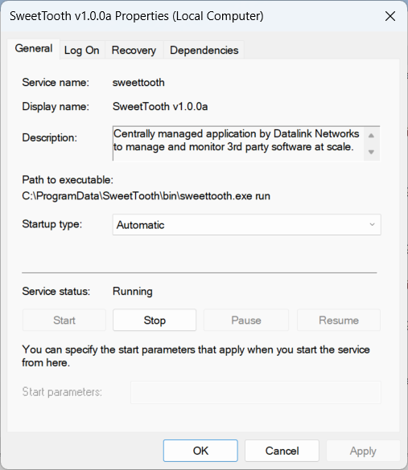

# SweetTooth Client

The sweettooth client is an agent service meant to run on modern Microsoft Windows endpoints which are supported by Chocolatey:

- Windows Server 2012, 2012 R2, 2016, 2019, 2022
- Windows 10, 11

It runs as a service and will perpetually perform the following logic loop:

1) Check the node's current registration status with the server
2) Acquire the node's maintenance schedule from the server if necessary
3) If the current iteration of the loop is inside the maintenance window, perform the Chocolatey package jobs (**install**, **upgrade**, or **uninstall**)
4) Inventory the system for software managed and unmanaged by Chocolatey. Report all changes in installed software and detected outdated software.

SweetTooth is designed to be a self-contained executable to make ease of distribution and whitelistic simple. It has built-in functionality to install itself into `C:\ProgramData\SweetTooth` and create the necessary files, to create the service, and to uninstall the service. These are the commands you can pass to SweetTooth:

```
sweettooth [requires flags] install
sweettooth uninstall
sweettooth start
sweettooth stop
sweettooth status
sweettooth run
```

## Installation

A basic installation is as follows:
```
sweettooth.exe -url https://sweettooth.example.com -token [Registration Token] install
```
| Flag | Type | Default | Description |
| ---- | ---- | ------- | ----------- |
| -url | string | *required* | The A URL for the SweetToooth server |
| -token | string | *required* | The token used to register the node with the server |
| -insecure | bool | false | Disable HTTPS certificate verification (not recommended) |
| -nopath | bool | false | Disables modifications to %PATH% |
| -override | bool | false | Install the current executable even if it exists |
| -loglevel | string | "info" | The logging level to use for sweettooth |

For the installation to be successful, it requires a successful registration process which means the server must be online and the registration token must be valid. Once verified, the binary is copied and the service is installed and started. After installation, the binary you used to install can be deleted.

## Service

The SweetTooth executable does not undergo a complex installation process, but it does create a service using the `kardianos/service` package which is visible from the Services Management Console (`win + r > services.msc`). This service can be started, stopped, or disabled at will.




## Directory

SweetTooth will create the following directories for each of its purposes:

```
C:\ProgramData\SweetTooth\
|
| bin\
|  - Contains the SweetTooth executable which is called by the service
|
| logs\
|  - Contains the logs SweetTooth writes to. Logs rotated every 25MB, retained for 1 year
|
| keys\
|  - Holds ED25519 keys in the plaintext `public.pem` and the encrypted `secret.pem`
|
| sweettooth.yaml
|  - Cofiguration file with basic client/server settings (created on install)
```

## Software Tracking

For the source of the software tracking feature of SweetTooth, we use the output of the following two commands:

- `choco list --include-programs`
    Includes the names and versions of software installed on the systemm managed by Chocolatey, or found in the installed programs
- `choco outdated`
    Includes any packages that are managed by chocolatey and have newer versions available. Include name and current/new versions.

Combined, these allow the tracking of any software changes on the running system. Anything installed inside or outside of Chocolatey will be reported and an administrator can view it, manually onboard software into Chocolatey, or install fresh packages.


## Authorization

Each node generates a public/private ED25519 keypair used for signing.

- The public key is submitted to and stored by the server upon registration.
- The private key is encrypted using Microsoft's DPAPI and saved to disk.
- When a node interacts with the server, it requires a signed authorization header token. The client will not be able to acquire jobs or submit software changes until it is approved.
- JWTs are time-sensitive. There is a generous amount of drift accounted for within the validation process, but if the system time is more than several minutes off, it is likely to fail to authenticate.